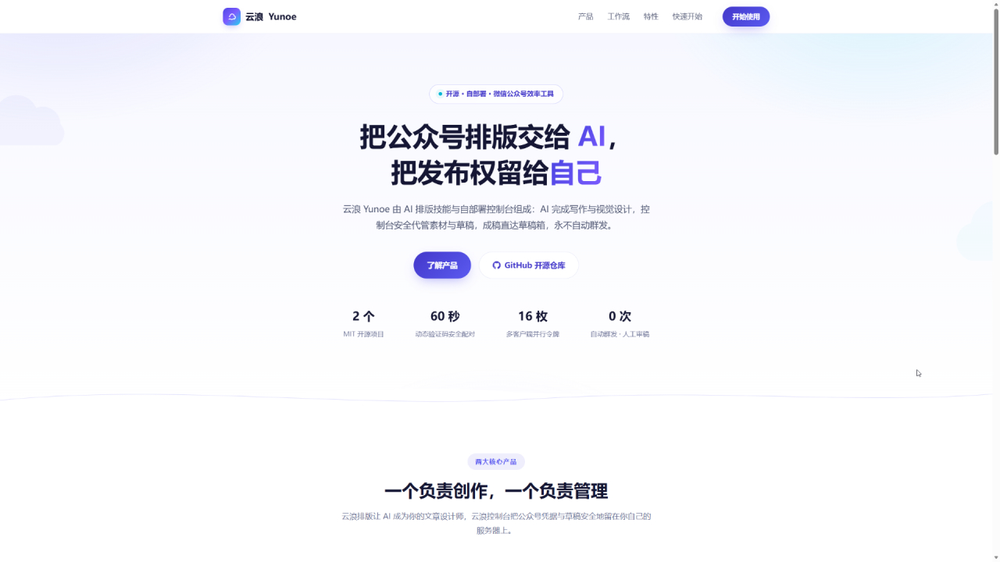
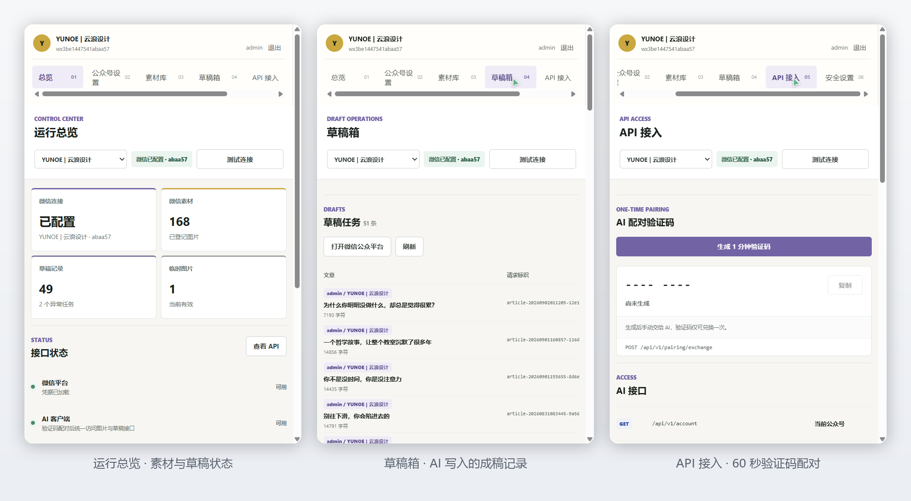

# 云浪控制台

一个部署在自有服务器上的微信公众号管理控制台。它代管 AppSecret、上传图片，并允许配对后的 AI 客户端新增、查询、修改和删除微信草稿。用户只需审稿和发布。



## 快速开始

```bash
cp .env.example .env
bash install.sh
```

首次启动会在私密终端显示一次性初始化码。用它创建管理员账号，再在控制台添加公众号并将服务器出口 IPv4 加入微信公众平台白名单。

服务默认监听 `127.0.0.1:8791`，可在 `.env` 中用 `YUNOE_HOST_PORT` 覆盖宿主机端口。本机个人使用可通过 HTTP 访问；公网环境建议配置 HTTPS，控制台会在 HTTP 下明确提醒验证码和客户端令牌为明文传输。

## AI 配对

本项目没有预置、显示或接受静态图片 Key、草稿 Key 或临时图片 Key。所有客户端权限都从验证码取得：

1. 管理员登录控制台，进入“API 接入”。
2. 生成 60 秒有效、仅可兑换一次的验证码。
3. 在本地 `yunoe` 客户端中输入控制台地址和验证码。
4. 服务端签发一枚统一客户端令牌，客户端在本地保存且不打印。

每次配对都会签发独立令牌，不会使 Codex、Trae 或其他已配对客户端失效；每个用户保留最近使用的 16 枚令牌。修改密码仍会撤销该用户的全部客户端令牌。数据库只保存令牌的 SHA-256 摘要。

## 主要能力

- 多用户、多公众号隔离管理，AppSecret 仅在服务器加密保存。
- 上传永久素材、正文图片及服务器临时图片；正文图 URL 自动规范为 HTTPS `mmbiz.qpic.cn`。
- 统一客户端令牌访问图片接口和草稿完整增删改查。
- 草稿删除先调用微信官方接口，再彻底清理本地记录。
- 永久素材删除调用微信官方删除接口；正文图片因微信没有删除接口，只能清理本地历史记录。
- 草稿创建使用 `request_id` 幂等保护，远端结果不确定时阻止盲目重试。
- 数据库升级前自动备份，v4 迁移会删除旧静态服务凭据表。



## 文档

- [服务器安装](INSTALL.zh-CN.md)
- [API 契约](API.zh-CN.md)
- [安全策略](SECURITY.md)
- [更新记录](CHANGELOG.md)

配套技能：[juneme/wechat-article-designer](https://github.com/juneme/wechat-article-designer)
