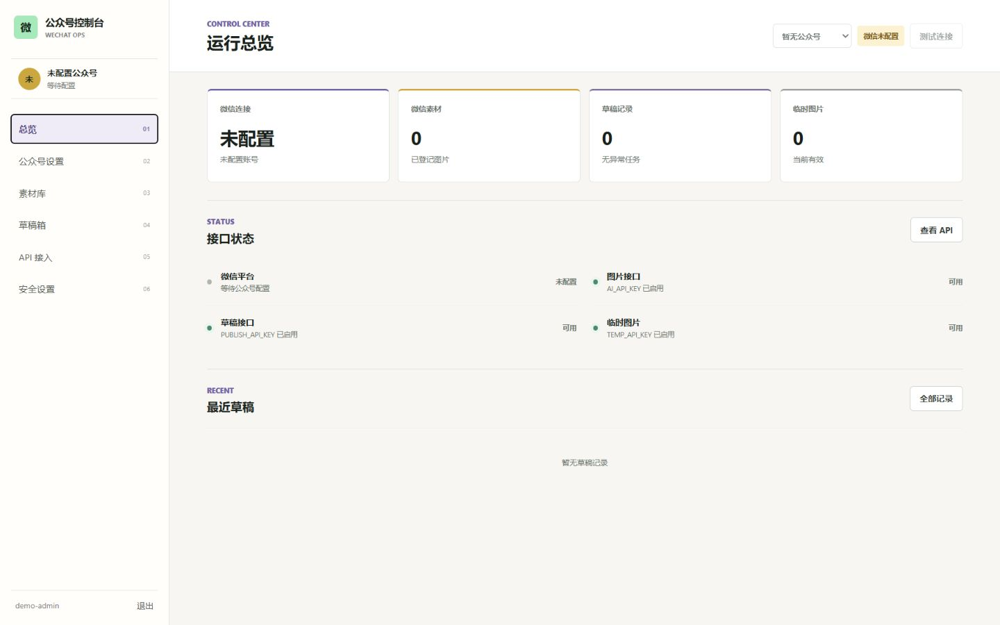
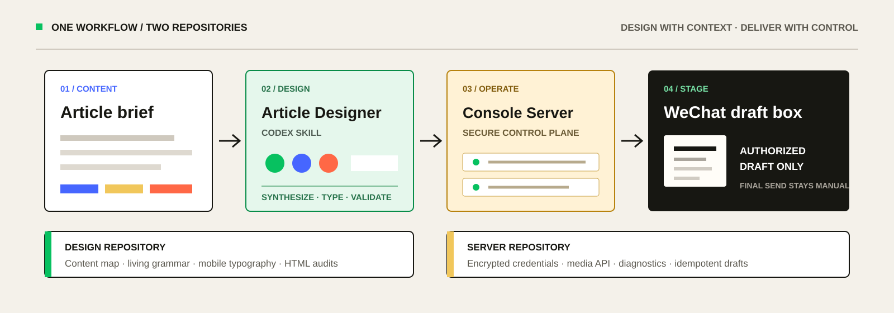
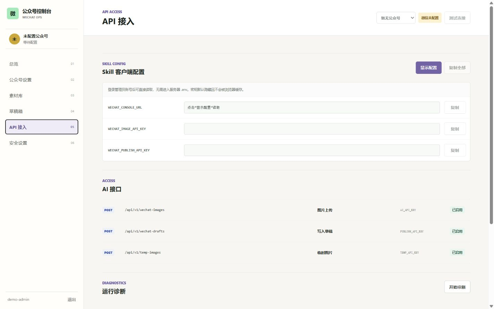

# 微信公众号控制台

[](https://github.com/juneme/wechat-console-server/releases/latest)
[](https://github.com/juneme/wechat-console-server/actions/workflows/ci.yml)
[](LICENSE)
[](https://github.com/juneme/wechat-article-designer)



部署在服务器上的多用户微信公众号控制台：加密托管 AppSecret，隔离用户、公众号、素材与草稿记录，并向 Codex 提供受控的图片上传和草稿写入接口。浏览器与 AI 客户端都无法读取 AppSecret。

## 完整项目 = Skill + Server

| 设计端：[`wechat-article-designer`](https://github.com/juneme/wechat-article-designer) | 交付端：本仓库 |
|---|---|
| 理解文章、综合原创视觉、组织中文移动排版、校验公众号 HTML | 管理公众号与凭据、上传图片、运行诊断、幂等写入草稿箱 |
| 安装在运行 Codex 的电脑上 | 部署在有固定公网出口 IP 的服务器上 |
| 不读取 AppSecret，不自动群发 | 不负责写文章，不向客户端暴露 AppSecret |



## 真实控制台



API Key 默认隐藏，配置响应禁止浏览器缓存；截图仅使用本地演示数据，不包含真实公众号凭据。

## 三步开始

### 1. 部署控制台

```bash
cp .env.example .env
bash install.sh
```

将 HTTPS 域名反向代理到 `http://127.0.0.1:8787`，使用脚本输出的一次性初始化码创建管理员，再添加公众号并把服务器出口 IPv4 加入微信公众平台白名单。完整要求见 [`INSTALL.zh-CN.md`](INSTALL.zh-CN.md)。

### 2. 取得 Skill 配置

登录后打开“API 接入 → Skill 客户端配置”，点击“显示配置”取得 `WECHAT_CONSOLE_URL`、`WECHAT_IMAGE_API_KEY` 和 `WECHAT_PUBLISH_API_KEY`。命令行维护入口仍可使用：

```bash
bash show-client-config.sh --url https://你的控制台域名 --show-secrets
```

该命令需要人工确认。不要把密钥提交到 Git、Issue、截图或聊天记录。

### 3. 安装设计 Skill

```powershell
git clone https://github.com/juneme/wechat-article-designer.git "$env:USERPROFILE\.codex\skills\wechat-article-designer"
```

把三个变量配置到运行 Codex 的用户环境，重启 Codex 后即可先预览文章：

```text
使用 $wechat-article-designer 制作这篇公众号文章，先预览，不要写入草稿箱。
```

确认内容后再明确授权“写入微信公众号草稿箱”。预览、排版或上传图片不会自动创建草稿，草稿也不会自动群发。API 契约见 [`API.zh-CN.md`](API.zh-CN.md)，Skill 直发规则见 [`direct-publishing.md`](https://github.com/juneme/wechat-article-designer/blob/main/references/direct-publishing.md)。

## 控制台能力

- 登录页开放用户自行注册，管理员与普通用户权限分离。
- 每个用户可添加、切换、编辑和删除多个订阅号或服务号，无需重启容器。
- 普通用户的公众号、素材、临时图片和草稿任务按归属隔离；管理员可只读查看全部用户的草稿归属。
- 统一查看微信连接、素材、草稿任务和 AI API 状态。
- 上传永久素材、正文图片，或使用服务器临时托管作为备选。
- 通过独立 Bearer Key 向 AI 提供图片上传和草稿写入接口。
- 对草稿请求执行 HTML、图片来源、字符数和幂等校验。
- 在“API 接口”页面执行不回传密钥的数据库、微信连接和 API 配置诊断。

## 用户与多公众号

管理员完成首次初始化后，登录页会显示注册入口。注册用户默认角色为普通用户，只能读取和操作自己的公众号及业务数据，不能读取管理员专属的 Skill API Key。密码修改只会注销当前用户的全部会话，不影响其他用户。

普通用户可通过登录会话调用 `POST /api/drafts`，把文章写入自己当前公众号；草稿页只显示当前公众号下自己的记录。管理员的草稿页和总览会汇总所有用户、所有公众号的草稿，并在每条记录前标出“用户名 / 公众号”；管理员只能删除自己名下的草稿，他人的记录保持只读。草稿列表使用分页加载。“打开微信公众平台”会在新标签进入官方登录入口，登录后再从微信后台进入草稿箱，避免依赖会过期的动态网页 token。

“公众号设置”支持多个账号。新增账号会自动设为当前公众号；顶部选择器或账号列表可切换当前公众号，切换后总览、微信素材和草稿记录会同步刷新。临时托管图片属于用户，可在该用户的不同公众号之间复用。删除公众号会级联删除该公众号的本地素材和草稿记录，不会批量调用微信接口删除远端内容。

Bearer Key 的图片和草稿 API 归管理员所有。未传请求头时使用管理员当前公众号；传入 `X-Wechat-Account-ID: <公众号ID>` 可指定管理员名下的其他公众号。普通注册用户的公众号不能通过管理员 API Key 访问。

## 上传模式

| 模式 | 微信接口 | 返回 | 适用场景 |
|---|---|---|---|
| 公众号素材（默认） | `/cgi-bin/material/add_material?type=image` | `media_id` + 素材 URL | 进入公众号素材库；BMP/PNG/JPEG/GIF，小于 10MB |
| 正文图片 | `/cgi-bin/media/uploadimg` | 正文图片 URL | 公众号文章正文；JPG/PNG，小于 1MB |
| 素材 + 正文 | 依次调用以上两个接口 | 两套结果 | 同一张图片既要进素材库，也要用于正文 |
| 服务器托管（备选） | 无需微信接口 | 公网图片 URL + JSON | 微信接口暂不可用或临时给 AI 读取图片 |

临时托管和正文模式会剥离图片元数据，并在需要时缩小尺寸、压缩到 1MB 以下。上传记录保存在 SQLite，刷新页面后会自动恢复。页面支持单条删除、勾选批量删除和全部删除：永久素材会同步调用微信删除接口；服务器托管会删除本地文件；正文图片没有微信撤销接口，只删除本地历史记录。

服务器临时托管默认最多占用 5GB、每用户最多 500MB，可分别通过 `TEMP_STORAGE_MAX_BYTES` 和 `TEMP_USER_STORAGE_MAX_BYTES` 调整。注册请求按来源和全局限流，用户总数及单用户公众号数量由 `MAX_USERS`、`MAX_ACCOUNTS_PER_USER` 限制。超过 4000 万像素的图片会被拒绝，防止异常图片耗尽内存。

## 临时图片 API

在 `.env` 设置独立的 `TEMP_API_KEY`。上传与列表接口使用 Bearer 认证，公开图片 URL 本身不需要认证。批量上传时重复使用 `images` 字段：

```bash
curl -X POST 'https://photos.example.com/api/v1/temp-images' \
  -H 'Authorization: Bearer YOUR_TEMP_API_KEY' \
  -F 'images=@photo-01.jpg' \
  -F 'images=@photo-02.png'

curl 'https://photos.example.com/api/v1/temp-images?limit=500' \
  -H 'Authorization: Bearer YOUR_TEMP_API_KEY'
```

每条数据包含 `filename`、`url`、`kind`、`width`、`height`、`processed_bytes`、`sha256`、`created_at` 和 `expires_at`，AI 可直接用文件名对应图片 URL。`PUBLIC_BASE_URL` 建议填写站点 HTTPS 根地址；留空时按当前请求的域名生成 URL。

## 微信侧准备

以下配置只影响三个微信上传模式，临时托管不需要微信密钥：

1. 在微信开发者平台取得公众号 `AppID` 和 `AppSecret`，部署后登录控制台的“公众号设置”保存。
2. 把服务器的固定公网出口 IPv4 加到公众号的 IP 白名单。
3. 确认该公众号具备素材管理接口权限。

`AppSecret` 可以由控制台加密写入 SQLite，也可继续通过服务器 `.env` 提供。不得放进网页 JavaScript、截图或公开仓库。

## Docker 部署

```bash
cd wechat-material-uploader
cp .env.example .env
# 所有配置均可留空，首次访问时由初始化界面引导配置
docker compose up -d --build
docker compose ps
curl http://127.0.0.1:8787/healthz
```

应用只绑定服务器本机 `127.0.0.1:8787`，必须通过 [nginx/wechat-uploader.conf](nginx/wechat-uploader.conf) 所示的 HTTPS 反向代理访问。全新数据库会生成 `/data/.wechat-setup-token`；`install.sh` 在私密终端显示该一次性初始化码，初始化成功后立即删除。管理员密码以 Argon2 哈希保存，API Key 使用本地密钥加密保存。

更新：

```bash
docker compose up -d --build
```

更新不会覆盖 `.env`，也不会删除 Docker 数据卷。数据库带有显式 schema 版本；发现旧版数据库时，程序会先在数据库同目录生成带时间戳的迁移前备份，再执行升级。部署前仍建议手工备份数据库；不要执行 `docker compose down -v`。

日志：

```bash
docker compose logs -f --tail=200 uploader
```

备份数据库：

```bash
docker compose cp uploader:/data/uploader.sqlite3 ./uploader-$(date +%F).sqlite3
```

轮换 Skill 使用的图片和草稿 API Key：

```bash
bash rotate-api-keys.sh
# 同时轮换临时图片 API Key
bash rotate-api-keys.sh --include-temp
```

脚本要求在交互终端输入 `ROTATE`，不会打印新密钥；容器未恢复健康时会还原旧 `.env`。轮换成功后，用 `show-client-config.sh --show-secrets` 在私密终端重新配置 Skill 客户端。

## 本地开发与测试

```bash
python -m venv .venv
source .venv/bin/activate
pip install -r requirements-dev.txt
cp .env.example .env
set -a; source .env; set +a
uvicorn app.main:app --reload
pytest -q
ruff check .
node --check app/static/app.js
```

Windows PowerShell 可用：

```powershell
py -3.12 -m venv .venv
.\.venv\Scripts\Activate.ps1
pip install -r requirements-dev.txt
$env:DATABASE_PATH=".\data\uploader.sqlite3"
$env:TEMP_STORAGE_PATH=".\data\temp-images"
uvicorn app.main:app --reload
```

构建并二次校验服务端发布包：

```bash
python scripts/build_release.py
python scripts/build_release.py --verify-only artifacts/wechat-console-server-v3.2.1-$(date +%Y%m%d).zip
```

服务端包只包含控制台、部署脚本和服务端文档，并使用白名单排除 `.env`、SQLite、密钥、缓存、旧产物及 Skill 源码；ZIP 内的 `RELEASE-MANIFEST.sha256` 可校验每个文件。Skill 在独立仓库中发布。

## 官方依据

- [新增草稿](https://developers.weixin.qq.com/doc/service/api/draftbox/draftmanage/api_draft_add)
- [上传永久素材](https://developers.weixin.qq.com/doc/service/api/material/permanent/api_addmaterial)
- [上传发表内容中的图片](https://developers.weixin.qq.com/doc/service/api/material/permanent/api_uploadimage)
- [获取稳定版接口调用凭据](https://developers.weixin.qq.com/doc/service/api/base/api_getstableaccesstoken)
- [AppID / AppSecret 官方说明](https://developers.weixin.qq.com/doc/oplatform/developers/dev/appid.html)
- [API 调用 IP 白名单](https://developers.weixin.qq.com/doc/oplatform/developers/basic_func/ip_whitelist.html)

微信官方明确要求这些接口在服务器端调用。永久素材图片 URL 主要用于腾讯系域名；文章正文应优先使用 `uploadimg` 返回的 URL。
